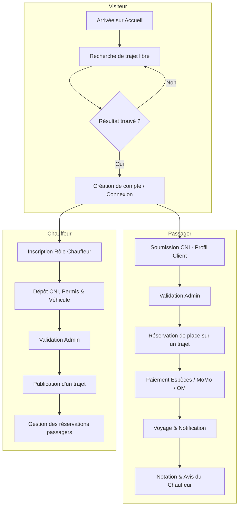

#  Maroua Covoiturage

[](https://www.python.org/)
[](https://www.djangoproject.com/)
[](https://tailwindcss.com/)
[](https://www.sqlite.org/)
[](#)
[](#)

> **Maroua Covoiturage** est une plateforme web moderne, intuitive et sécurisée de mise en relation pour le covoiturage urbain et interurbain dans la ville de Maroua et la région de l'Extrême-Nord du Cameroun.

---


## Contexte & Objectifs

Dans le contexte urbain de **Maroua** (déplacements entre campus universitaires de Kongola et Djarengol, centre-ville, quartiers périphériques, et liaisons régionales vers Salak, Mokolo, Mora, Kousseri, Yagoua), les usagers font face à des défis récurrents de mobilité : rareté des moyens de transport aux heures de pointe, coûts fluctuants et manque de sécurité.

**Maroua Covoiturage** répond à cette problématique en proposant une solution :
1. **Économique :** Partage équitable des frais de carburant selon des tarifs régulés et transparents.
2. **Sécurisée :** Vérification stricte et préalable (KYC) de l'identité des chauffeurs, de leurs permis et de leurs véhicules avant toute publication de trajet.
3. **Solidaire & Écologique :** Optimisation du taux d'occupation des véhicules en circulation pour désengorger les axes routiers et réduire l'empreinte carbone.

---

##  Fonctionnalités Clés

###  Pour les Visiteurs / Grand Public
- **Recherche Ouverte Sans Compte :** Consultation libre des offres de trajets disponibles depuis la page d'accueil ou `/search/`.
- **Filtres multicritères :** Lieu de départ, destination, date du voyage, nombre de places souhaité, fourchette de prix (min/max).

### Pour les Passagers
- **Inscription & Profil :** Création d'un compte passager avec gestion des coordonnées et photo de profil.
- **Vérification d'identité (KYC unique) :** Soumission de la CNI en une seule fois pour valider le profil.
- **Réservation en direct :** Choix du nombre de places et réservation instantanée sur les trajets ouverts.
- **Paiement Flexible :** Choix du mode de paiement :
  -  *Espèces à bord*
  -  *MTN Mobile Money*
  -  *Orange Money*
- **Historique & Suivi :** Tableau de bord pour suivre l'état de ses réservations (en attente, confirmée, terminée, annulée).
- **Avis & Notations :** Possibilité d'évaluer le chauffeur (1 à 5 étoiles + commentaire) à l'issue du voyage.

### Pour les Chauffeurs
- **Espace Chauffeur Dédié :** Inscription avec rôle *Chauffeur*.
- **Dossier de Conformité :** Téléversement de la CNI, du permis de conduire et enregistrement du véhicule (marque, modèle, immatriculation, carte grise/assurance).
- **Publication de Trajets Encadrée :** Sélection de routes prédéfinies avec tarification automatique fixée par l'administration (évite la spéculation).
- **Gestion des Places :** Décrémentation automatique des places disponibles et bascule au statut *Complet*.
- **Tableau de Bord & Évaluations :** Suivi des réservations reçues et consultation de sa note moyenne.

### Pour les Administrateurs (Django Admin en Français)
- **Validation KYC :** Approbation ou rejet des pièces d'identité passagers, profils chauffeurs et véhicules.
- **Gestion des Itinéraires & Tarifs :** Définition des trajets officiels (`Route`), points de départ, destinations, distances et prix unitaires applicables.
- **Supervision Globale :** Suivi en temps réel des utilisateurs, trajets, réservations, paiements et signalements.

---

## Architecture & Modules Django

Le projet est conçu selon une architecture modulaire et découplée en applications Django spécialisées :

| Application | Description & Responsabilité | Modèles Principaux |
| :--- | :--- | :--- |
| `accounts` | Gestion des comptes, authentification, rôles (`DRIVER`, `PASSENGER`) et paramètres profil | `User` |
| `verification` | Gestion des pièces justificatives (CNI, permis) et workflow de validation KYC | `ClientVerification`, `DriverProfile` |
| `vehicles` | Gestion du parc automobile des chauffeurs et documents associés (assurance, etc.) | `Vehicle`, `VehicleDocument` |
| `routes` | Catalogue des itinéraires autorisés, distances et barèmes tarifaires officiels | `Route` |
| `trips` | Cycle de vie des offres de trajets publiées par les chauffeurs | `TripOffer`, `TripStatus` |
| `bookings` | Gestion des demandes et réservations de places côté passager | `Booking`, `BookingStatus` |
| `payments` | Gestion et simulation des transactions (Cash, MTN MoMo, Orange Money) | `Payment`, `PaymentMethod`, `PaymentStatus` |
| `search` | Moteur de recherche et filtres de recherche de trajets | *(Logique de requêtage ORM)* |
| `ratings` | Système d'avis, notes étoilées et calcul des moyennes de réputation | `Rating` |
| `notifications`| Système de notifications in-app avec badge de notifications non lues | `Notification`, `NotificationType` |
| `core` | Page d'accueil, mise en page globale et composants transversaux | *(Vues générales et templates)* |

---

## Règles Métier & Sécurité (KYC)

1. **Vérification Obligatoire avant Publication :** Un chauffeur ne peut publier aucune offre de trajet tant que son profil et son véhicule n'ont pas été validés (`status = 'VALIDE'`) par un administrateur.
2. **Protection des Données Passager :** Le passager fournit ses pièces d'identité une seule fois lors de la validation de son compte. Aucune pièce sensible n'est redemandée lors des réservations.
3. **Prix Encadrés par l'Itinéraire :** Pour éviter les abus et la spéculation sur les prix, le tarif unitaire d'un trajet est automatiquement hérité de la `Route` configurée par l'administration.
4. **Calculs & Validation Côté Serveur :** Les places restantes, dates limites de départ, calculs de montants totaux et vérifications d'éligibilité sont intégralement validés côté backend.
5. **Sécurité Financière :** Aucun code PIN bancaire ou Mobile Money n'est jamais collecté, demandé ou stocké sur la plateforme.

---

## Stack Technique

- **Langage de programmation :** Python 3.12+
- **Framework Web Backend :** Django 6.1 (Architecture MVT, ORM, Système d'authentification personnalisé)
- **Base de données :** SQLite 3 (extensible vers PostgreSQL / MySQL)
- **Frontend & UI :** Django Templates, HTML5, CSS3, JavaScript
- **Framework CSS & Icônes :** Tailwind CSS (utilitaires & responsive design), Font Awesome 6.5
- **Traitement d'images :** Pillow (gestion des avatars, documents CNI/permis et photos de véhicules)
- **Internationalisation & Fuseau :** Français (`fr`), Fuseau horaire Cameroun (`Africa/Douala`)

---

## Parcours Utilisateurs



---

## Structure du Projet

```text
co-voiturage/
├── accounts/               # Authentification, modèle User sur mesure, profils
├── bookings/               # Réservations de places et validation de disponibilité
├── config/                 # Paramètres globaux Django (settings, urls, wsgi, asgi)
├── core/                   # Vues d'accueil et pages génériques
├── covoiturage/             # Configuration applicative de base
├── notifications/          # Notifications internes in-app & context processor
├── payments/               # Gestion des paiements (Cash, MoMo, Orange Money)
├── ratings/                # Avis et notes attribuées aux chauffeurs
├── routes/                 # Itinéraires officiels et tarification administrée
├── search/                 # Moteur de recherche de trajets
├── templates/              # Gabarits HTML (Tailwind CSS + Django Templates)
│   ├── accounts/
│   ├── bookings/
│   ├── core/
│   ├── notifications/
│   ├── payments/
│   ├── ratings/
│   ├── search/
│   ├── trips/
│   └── verification/
├── trips/                  # Publication, gestion et cycle de vie des trajets
├── vehicles/               # Modèles de véhicules et documents techniques
├── verification/           # Profils KYC (passagers et chauffeurs)
├── media/                  # Fichiers médias téléversés (photos, CNI, permis)
├── db.sqlite3              # Base de données SQLite locale
├── manage.py               # Script utilitaire d'administration Django
├── requirements.txt        # Dépendances Python du projet
└── README.md               # Documentation officielle du projet
```

---

## Installation & Démarrage

### 1. Prérequis
- **Python 3.12+** installé sur votre machine ([Télécharger Python](https://www.python.org/downloads/)).
- **Git** pour cloner le projet.

### 2. Cloner le projet ou ouvrir le dossier

```bash
cd "co-voiturage"
```

### 3. Créer et activer l'environnement virtuel

- **Sous Windows (PowerShell) :**
  ```powershell
  python -m venv venv
  .\venv\Scripts\Activate.ps1
  ```

- **Sous Linux / macOS :**
  ```bash
  python3 -m venv venv
  source venv/bin/activate
  ```

### 4. Installer les dépendances

```bash
pip install -r requirements.txt
```

### 5. Appliquer les migrations de base de données

```bash
python manage.py migrate
```

### 6. Créer un compte administrateur (Superuser)

```bash
python manage.py createsuperuser
```
*(Renseignez votre nom d'utilisateur, email et mot de passe).*

### 7. Lancer le serveur de développement

```bash
python manage.py runserver
```

Rendez-vous sur votre navigateur à l'adresse : **[http://127.0.0.1:8000/](http://127.0.0.1:8000/)**

---

## Cartographie des Routes & URLs

| Section | URL | Rôle / Accès | Description |
| :--- | :--- | :--- | :--- |
| **Accueil** | `/` | Public | Page d'accueil avec présentation et moteur de recherche rapide |
| **Recherche** | `/search/` | Public | Recherche avancée de trajets avec filtres (prix, date, places) |
| **Inscription** | `/accounts/signup/` | Public | Inscription avec sélection du rôle (*Chauffeur* ou *Passager*) |
| **Connexion** | `/accounts/login/` | Public | Connexion à la plateforme |
| **Paramètres** | `/accounts/parametres/` | Authentifié | Modification des coordonnées, mot de passe et photo de profil |
| **Espace Personnel** | `/trips/` | Authentifié | Tableau de bord (mes trajets publiés / mes réservations) |
| **Publier un Trajet**| `/trips/publish/` | Chauffeur vérifié | Formulaire de publication d'une offre de covoiturage |
| **Réservation** | `/bookings/create/<id>/` | Passager vérifié | Réservation de places sur un trajet disponible |
| **Paiement** | `/payments/pay/<id>/` | Passager | Choix du mode de règlement (Espèces, MTN MoMo, Orange Money) |
| **Évaluation** | `/ratings/rate/<id>/` | Passager | Notation et dépôt d'un avis après la fin d'un trajet |
| **Notifications** | `/notifications/` | Authentifié | Consultation et marquage des notifications reçues |
| **Vérification** | `/verification/chauffeur/` | Chauffeur | Soumission du dossier KYC (CNI, Permis, Véhicule) |
| **Administration** | `/admin/` | Staff / Superuser | Back-office complet de gestion et validation de la plateforme |

---

## Tests Unitaires & Intégration

Le projet inclut une suite de tests unitaires couvrant la conformité des modèles, les flux de réservation, les règles de tarification et les permissions utilisateurs.

Pour exécuter l'ensemble des tests :

```powershell
python manage.py test
```

---

## Sécurité & Confidentialité

- **Stockage Sécurisé :** Les mots de passe utilisateurs sont hachés avec l'algorithme standard PBKDF2 de Django.
- **Protection CSRF & Clickjacking :** Middleware de sécurité Django activé sur tous les formulaires et requêtes POST.
- **Séparation des Médias :** Les documents d'identité (CNI, Permis) sont stockés dans des répertoires distincts dédiés à la vérification administrative.
- **Paiements sans rétention de données sensibles :** Aucun code secret PIN ni identifiant bancaire n'est requis ni enregistré.

---

##  Auteurs & Cadre Académique

Ce projet a été conçu et réalisé dans le cadre du **Stage d'Ingénieur (IC4)** à :

- **Établissement :** École Nationale Supérieure Polytechnique de Maroua (ENSPM) — Université de Maroua
- **Filière :** Informatique et Télécommunications
- **Année Académique :** 2025 - 2026
- **Localisation :** Maroua, Région de l'Extrême-Nord, Cameroun

---

*© 2026 Maroua Covoiturage — Partageons, économisons, voyageons en toute sécurité.*
